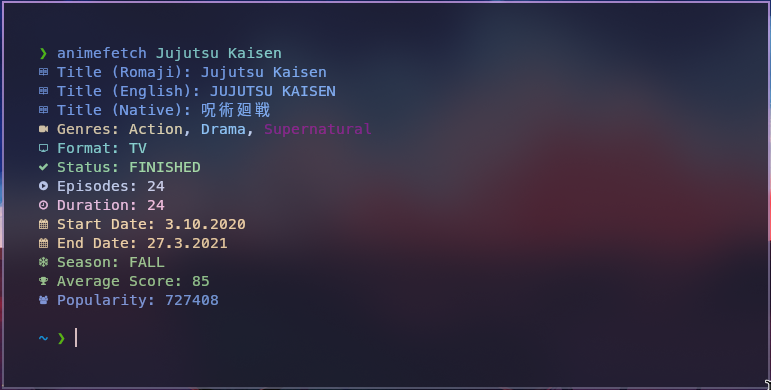

# AnimeFetch

<h3>Your anime companion, fetching details from AniList API with ease 🚀</h3>


**AnimeFetch** is a simple yet powerful tool that connects to the AniList API to retrieve and display detailed information about your favorite anime. Whether you need synopses, episode counts, release years, or ratings, AnimeFetch has you covered.

**Why build this?** Because I need to learn C++ and I couldn't think of any other project to do lol. Btw, C++ is awesome 🔥



## 💻 Installation

If you're using Arch-based distribution, you can download `animefetch` from AUR:

```bash
$ yay -S animefetch
```

If you're not using an Arch-based distribution, you can compile it yourself:

```bash
$ git clone https://github.com/xeyossr/animefetch
$ mkdir build
$ cd build
$ cmake ..
$ make
$ sudo cp build/animefetch /usr/bin/animefetch
```

## 👾 Usage

```bash
$ animefetch <anime-title>
```

For example:

```bash
$ animefetch Jujutsu Kaisen
```

## License

This project is licensed under the GNU General Public License v3.0. You are free to use, modify, and distribute the software under the terms of this license. For more details, please refer to the [LICENSE](LICENSE) file.
